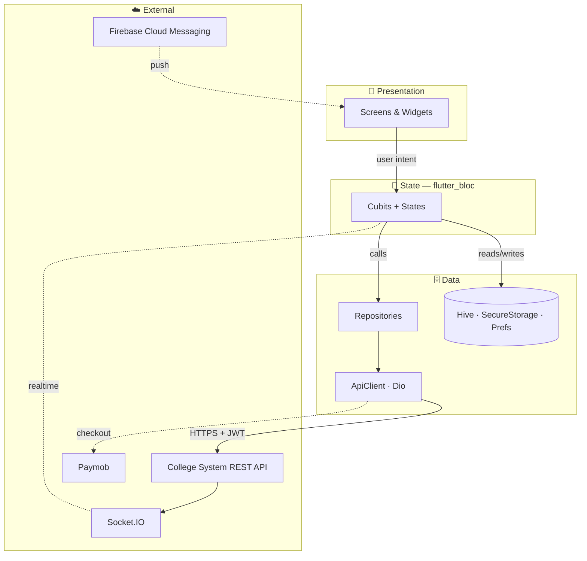
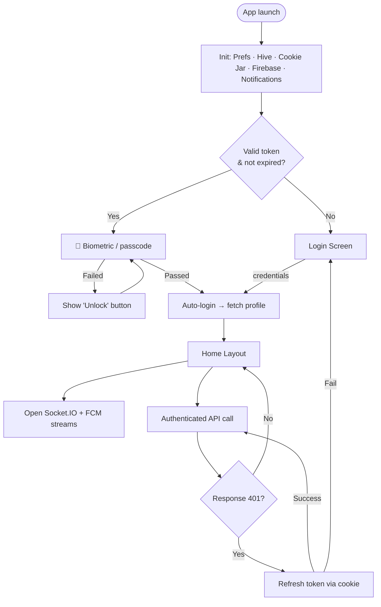

<div align="center">


# Academia

### Your campus, in your pocket

A cross-platform student portal that brings the entire campus experience — grades, schedules, exams, payments, attendance, community and more — into a single Flutter app.

[](https://flutter.dev)
[](https://dart.dev)
[](https://bloclibrary.dev)
[](#-architecture)
[](#-platform-support)
[-success)](#-localization)
[](#-license)

<a href="#-getting-started"><b>Getting Started</b></a> ·
<a href="#-features"><b>Features</b></a> ·
<a href="#-architecture"><b>Architecture</b></a> ·
<a href="#-screenshots"><b>Screenshots</b></a> ·
<a href="#-roadmap"><b>Roadmap</b></a>

</div>

---

## ⭐ Highlights

- 🎯 **17 self-contained features** built on a clean, scalable **feature-first** architecture (`Screen → Cubit → Repo → ApiClient`).
- 🔐 **Production-grade auth** — JWT access tokens with silent refresh, persistent refresh-token cookie, and a **biometric app lock**.
- 🔔 **Dual-channel real-time notifications** — Socket.IO live events **and** Firebase Cloud Messaging push, unified into system-tray notifications.
- 🌍 **Fully localized** — English & Arabic with automatic **RTL** layout, switchable at runtime.
- 🌓 **Material 3** design with persisted **light/dark** themes and responsive sizing on every screen.
- 💳 **Real integrations** — Paymob online payments, QR attendance scanning, in-app PDF viewing, and a campus FAQ assistant.
- 🧩 **~25K lines of Dart** organized for readability and testability across 6 platforms.

---

## 📖 Overview

**Academia** is a feature-rich mobile application that acts as a digital companion for university students. It connects to a dedicated backend (the College System API) and lets students manage their entire academic life from one place: viewing grades and GPA, registering for courses, checking exam timetables, scanning attendance QR codes, paying invoices, browsing study materials, chatting with a campus FAQ assistant, and engaging with the student community — wrapped in a polished, responsive UI with full **dark mode** and **English / Arabic (RTL)** support.

> Originally built as a graduation project, Academia demonstrates a clean, scalable architecture backed by real-time notifications, biometric security, and a robust networking layer.

---

## 📊 Project Statistics

> Derived directly from the codebase.

| Metric | Value | Metric | Value |
| --- | :---: | --- | :---: |
| Dart source files | **169** | Feature modules | **17** |
| Lines of Dart (excl. generated) | **~25,300** | Cubits (state) | **20** |
| Repositories | **17** | Data models | **26** |
| Screens | **23** | Feature widgets | **38** |
| API endpoints | **44** | App routes | **18** |
| Production packages | **25+** | Languages | **EN · AR** |

---

## 🖼️ Screenshots

> _Add your screenshots here — replace the placeholders below._

<div align="center">

| Home | Courses & Grades | Schedule | Community |
| :---: | :---: | :---: | :---: |
|  |  |  |  |
| **Digital ID** | **Attendance (QR)** | **Payments** | **Dark Mode** |
|  |  |  |  |

</div>

### 🎬 Demo

| Animated walkthrough | Full video |
| :---: | :---: |
|  | [▶️ Watch the demo video](#) _(add link)_ |

---

## ✨ Features

| Area | What it does |
| --- | --- |
| 🔐 **Authentication** | Email/password login with JWT access tokens and an HTTP-only refresh-token cookie; sessions restored on launch and silently refreshed on `401`. |
| 🧬 **Biometric App Lock** | Returning sessions are gated behind device biometrics (fingerprint / Face ID) or passcode via `local_auth`. |
| 🏠 **Home Dashboard** | Profile card, quick actions, recent grades, upcoming exams, attendance, tasks, payments and notification previews. |
| 📚 **Courses & Grades** | Enrolled courses, per-course grade breakdowns and a GPA summary. |
| ➕ **Course Registration** | Available offerings, course & lab registration, group selection, and course drop with a live registered-courses table. |
| 📝 **Exams Dashboard** | Filterable exam schedule with detailed exam cards. |
| 🗓️ **Class Schedule** | Weekly timetable in both grid and list views. |
| 📄 **Study Materials** | Searchable material library with in-app PDF viewing and downloads. |
| 🪪 **Digital Student ID** | Digital ID card (front/back) with a privileges table and QR code. |
| ✅ **Attendance** | Scan session QR codes to mark attendance; view active sessions and history. |
| 💳 **Payments** | Invoices and outstanding balances, paid online via embedded Paymob checkout. |
| 🏆 **Leaderboard** | Student ranking for a gamified, competitive layer. |
| 👥 **Community** | Social feed with posts, likes and comments, plus suggested/your study groups. |
| 🗂️ **Tasks** | View available tasks and submit assignments. |
| 🤖 **Chatbot / FAQ** | Category-based campus FAQ assistant. |
| 🔔 **Notifications** | Real-time via Socket.IO + Firebase Cloud Messaging, surfaced as system-tray notifications with an unread badge. |
| ⚙️ **Settings** | Theme toggle, language switch, edit profile, change password and logout. |

---

## 🏗️ Architecture

A **feature-first** layout with a clear split between a shared **core** layer and self-contained **features**. Each feature owns its UI, state, models and data access, and follows the same flow:

```
Screen  →  Cubit (state)  →  Repository (data)  →  ApiClient (network)
```



<details>
<summary><b>📁 Directory layout</b></summary>

```
lib/
├── main.dart                 # Bootstrap: Firebase, FCM, notifications, cookie jar
├── firebase_options.dart     # Generated FlutterFire config
│
├── core/                     # Cross-cutting infrastructure
│   ├── appCubit/             # Global app state (theme, locale)
│   ├── constants/            # Constants + API endpoints
│   ├── data/
│   │   ├── local/            # Hive + SharedPreferences helpers
│   │   └── network/          # Dio ApiClient, exceptions
│   ├── routing/              # go_router routes & configuration
│   ├── services/             # Local (biometric) auth service
│   ├── styles/               # Colors, fonts, text styles, assets
│   ├── utils/                # Shared components
│   └── widgets/              # Reusable widgets
│
├── features/                 # One folder per feature (17 total)
│   └── <feature>/
│       ├── cubit/            # Cubit + states
│       ├── models/           # Data models
│       ├── repo/             # Repository (talks to ApiClient)
│       ├── widgets/          # Feature-specific widgets
│       └── <feature>_screen.dart
│
├── layout/                   # Bottom-nav shell (Home/Courses/Register/Exams/Profile)
└── generated/                # Localization (intl) generated code
```

</details>

---

## 🔄 Application Flow

Startup, biometric gate, session restore, and the auto-refresh path:



---

## ☁️ Backend Overview

Academia is the **client**; it talks to a separate **College System** backend (not included in this repo). The contract the app relies on:

- **REST API** under `…/api/v1` consumed through a single typed `ApiClient` — **44** endpoints spanning auth, profile, courses, registration, exams, schedule, materials, attendance, payments, community, tasks and notifications.
- **Auth model** — `POST /auth/login` issues a JWT **access token** plus an HTTP-only **refresh-token cookie**; `POST /auth/refresh` mints new access tokens using only the cookie.
- **Realtime** — a **Socket.IO** server on the default namespace; JWT is passed via the auth map. Server emits `new-notification` and `unread-count`; clients are auto-joined to their own room.
- **Push** — **Firebase Cloud Messaging**; the app registers its device token via `/notifications/register-device`.
- **Payments** — Paymob order creation (`/payments/invoices/paymob-order`) completed inside an in-app WebView.

> Swap deployments by editing the URLs in [`lib/core/constants/endpoints.dart`](lib/core/constants/endpoints.dart).

---

## 🔒 Security

- **Token storage** — access token and expiry kept in `flutter_secure_storage` (Keychain / Keystore), never in plain prefs.
- **Refresh-token cookie** — held in a disk-backed `PersistCookieJar` and **cleared on logout** so it can't be replayed.
- **Token-less refresh client** — a dedicated Dio instance handles `/auth/refresh` and never leaks the expired `Authorization` header.
- **Biometric gate** — app access is protected by device biometrics / passcode, with a graceful fallback when no lock is enrolled.
- **Transport** — all traffic over HTTPS with bearer-token authorization.
- **Single-retry refresh** — `401`s trigger exactly one refresh-and-retry with concurrent-request de-duplication, preventing refresh storms.

---

## ⚡ Performance

- **`IndexedStack` shell** keeps the five primary tabs alive, preserving scroll position and avoiding rebuild cost on tab switch.
- **Connection de-duplication** — concurrent token refreshes share a single in-flight future; Socket.IO reuses an existing live connection.
- **Image caching** via `cached_network_image` to cut redundant network fetches.
- **Local-first data** — Hive + SharedPreferences cache settings and data for instant cold starts.
- **WebSocket-only transport** for Socket.IO (no long-polling fallback) for lower-latency events.
- **Responsive layouts** with `flutter_screenutil` against a `390×844` baseline for consistent rendering across screen sizes.
- **Over-the-air updates** ready via Shorebird code push (`shorebird.yaml`).

---

## 🧰 Tech Stack

| Concern | Package(s) |
| --- | --- |
| **Framework** | Flutter (Dart SDK `^3.8.1`), Material 3 |
| **State management** | `flutter_bloc` (Cubit) |
| **Navigation** | `go_router` |
| **Networking** | `dio`, `dio_cookie_manager`, `cookie_jar` |
| **Local storage** | `hive` / `hive_flutter`, `shared_preferences`, `flutter_secure_storage` |
| **Responsive UI** | `flutter_screenutil` |
| **Localization** | `flutter_localizations`, `intl`, `intl_utils` |
| **Notifications** | `firebase_core`, `firebase_messaging`, `flutter_local_notifications`, `socket_io_client` |
| **Media & files** | `cached_network_image`, `image_picker`, `flutter_cached_pdfview`, `url_launcher` |
| **Device features** | `mobile_scanner` (QR), `geolocator`, `local_auth`, `webview_flutter` |
| **Payments** | Paymob (via embedded WebView) |
| **Tooling** | `build_runner`, `hive_generator`, `flutter_launcher_icons`, `flutter_lints` |

---

## 🚀 Getting Started

### Prerequisites

- **Flutter SDK** 3.8+ ([install guide](https://docs.flutter.dev/get-started/install)) · **Dart** 3.8+ (bundled)
- VS Code / Android Studio with the Flutter & Dart plugins
- Android SDK (min SDK **21**) and/or Xcode for mobile builds

### Installation

```bash
# 1. Clone
git clone <your-repo-url>
cd college_project

# 2. Install dependencies
flutter pub get

# 3. Regenerate code (after model/Hive or localization changes)
dart run build_runner build --delete-conflicting-outputs
flutter pub run intl_utils:generate

# 4. Run
flutter run
```

### Firebase setup

A generated `lib/firebase_options.dart` is included; for your own project:

```bash
dart pub global activate flutterfire_cli
flutterfire configure
```

This regenerates `firebase_options.dart` and platform config (`google-services.json` / `GoogleService-Info.plist`).

### Backend configuration

Point the URLs in [`lib/core/constants/endpoints.dart`](lib/core/constants/endpoints.dart) at your own deployment:

```dart
static const String baseUrl =
    "https://college-system-backend.onrender.com/api/v1";
static const String notificationsSocketIO =
    "https://college-system-backend.onrender.com";
```

---

## 🌍 Localization

- Ships with **English** and **Arabic** (`lib/l10n/intl_en.arb`, `intl_ar.arb`).
- Arabic enables full **RTL** automatically; language is persisted and switchable at runtime.
- Add/edit strings in the `.arb` files, then run `flutter pub run intl_utils:generate`.

---

## 🎨 Theming

- **Material 3** with a seeded color scheme from the brand primary color.
- **Light & dark** themes with custom surfaces, persisted and toggled at runtime via `AppCubit`.
- **Poppins** global font; responsive sizing via `flutter_screenutil`.

---

## 📱 Platform Support

| Platform | Status |
| --- | --- |
| Android | ✅ Primary target (min SDK 21, app label **Academia**) |
| iOS | ✅ Supported |
| Web | ✅ Configured |
| Windows / macOS / Linux | ✅ Configured |

> Mobile is the primary target — biometric lock, QR scanning, push notifications and camera features shine there.

---

## 🛠️ Useful Commands

```bash
flutter pub get                  # Fetch dependencies
flutter run                      # Run on device/emulator
flutter analyze                  # Static analysis / lints
flutter test                     # Run tests
flutter build apk --release      # Android APK
flutter build appbundle          # Android App Bundle
flutter build ios                # iOS (on macOS)
dart run build_runner build --delete-conflicting-outputs   # Codegen
```

---

## 🗺️ Roadmap

- [ ] Add a `LICENSE` file to clarify usage rights
- [ ] Set a production `applicationId` (currently `com.example.college_project`)
- [ ] Capture and embed real screenshots, demo GIF and video
- [ ] Widget & unit test coverage for cubits and repositories
- [ ] CI pipeline (`flutter analyze` + `flutter test`) on pull requests
- [ ] Wire FCM `onTokenRefresh` to the device-registration endpoint
- [ ] Offline-first caching for grades and schedule

> Contributions toward any roadmap item are welcome.

---

## 🤝 Contributing

1. Fork and create a feature branch.
2. Follow the **feature-first** structure (`screen → cubit → repo → ApiClient`).
3. Run `flutter analyze` and ensure the app builds before opening a PR.
4. Keep user-facing strings in the `.arb` files (no hard-coded text).

---

## 📜 License

No license file is currently included. To open-source the project, add a `LICENSE` (e.g. MIT) to clarify usage rights.

---

<div align="center">

Built with ❤️ and **Flutter**.

</div>
