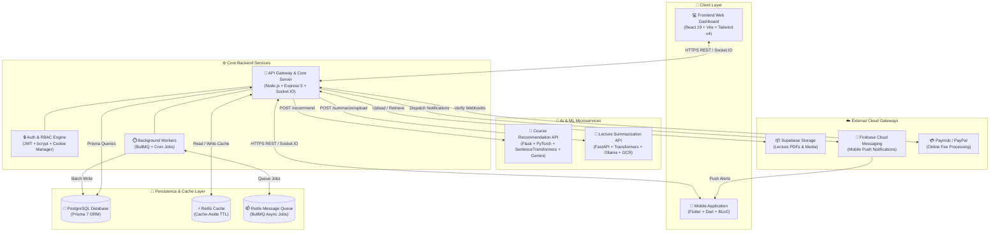
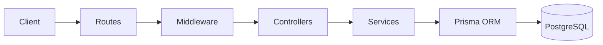
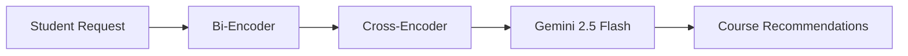
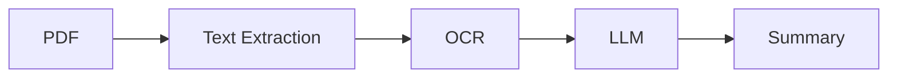
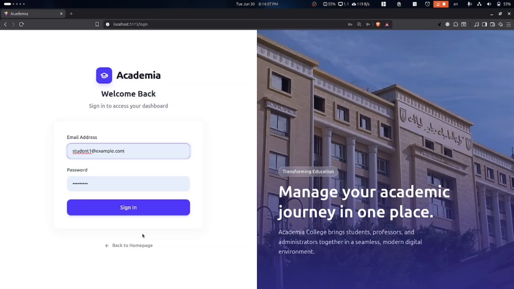

<div align="center">
  

# 🎓 Academia - College Management Ecosystem

_A modern full-stack college management ecosystem integrating a web dashboard, backend API, mobile application, and AI-powered academic services._

  <br>

[](LICENSE)
[](https://github.com/MuhammedMahmoud0/Academia-College-Management-Ecosystem/stargazers)
[](https://github.com/MuhammedMahmoud0/Academia-College-Management-Ecosystem/graphs/contributors)
[](https://github.com/MuhammedMahmoud0/Academia-College-Management-Ecosystem/commits/main)

  <br>

[](https://nodejs.org/)
[](https://expressjs.com/)
[](https://www.postgresql.org/)
[](https://www.prisma.io/)
[](https://reactjs.org/)
[](https://vitejs.dev/)
[](https://tailwindcss.com/)
[](https://flutter.dev/)
[](https://www.python.org/)
[](https://pytorch.org/)
[](https://fastapi.tiangolo.com/)
[](https://www.docker.com/)

</div>

<br>


---

- [Overview](#overview)
- [Features](#features)
- [System Architecture](#system-architecture)
- [Technology Stack](#technology-stack)
- [Repository Structure](#repository-structure)
- [Frontend](#frontend)
- [Backend](#backend)
- [Mobile Application](#mobile-application)
- [AI & Machine Learning](#ai-machine-learning)
    - [Course Recommendation System](#course-recommendation-system)
    - [Lecture Summarization System](#lecture-summarization-system)
- [Deployment](#deployment)
- [Team](#team)
- [Demo Videos](#demo-videos)
- [License](#license)

<br>

<a id="overview"></a>


---

The **Academia College Management Ecosystem** is a full-stack university management platform designed to simplify academic and administrative workflows. It consists of four integrated components—a web application, backend API, mobile application, and AI services—that work together to provide a unified experience for students, instructors, and administrators.

The backend serves as the central hub of the ecosystem, exposing REST APIs and real-time communication through Socket.IO. The React web dashboard and Flutter mobile application consume these services, while dedicated AI microservices provide intelligent course recommendations and lecture summarization. Data is stored in PostgreSQL with Supabase Storage for file management, and Redis powers caching and background job processing.

<br>

<a id="features"></a>


---

- 🔐 Authentication & Role-Based Access Control
- 👨‍🎓 Student & Staff Management
- 📚 Course Registration & Enrollment
- 📅 Attendance Tracking
- 📝 Exams & Grades
- 💳 Financial Management
- 👥 Community Platform
- 📁 Course Materials
- 📱 Mobile Application
- 🤖 AI Course Recommendation
- 📝 AI Lecture Summarization
- ⚡ Real-Time Notifications

<br>

<a id="system-architecture"></a>


---

The following diagram illustrates the complete architectural topology of the Academia ecosystem, detailing data pathways between clients, API gateways, databases, background job queues, and specialized AI microservices:



<br>

<a id="technology-stack"></a>


---

### 🚀 Backend

| Category        | Technologies             |
| --------------- | ------------------------ |
| Runtime         | Node.js, Express.js      |
| Database        | PostgreSQL, Prisma ORM   |
| Authentication  | JWT, bcrypt              |
| Real-Time       | Socket.IO                |
| Background Jobs | BullMQ, Redis            |
| File Storage    | Supabase Storage, Multer |
| Documentation   | Swagger / OpenAPI        |

### 💻 Frontend

| Category           | Technologies              |
| ------------------ | ------------------------- |
| Framework          | React, Vite               |
| Styling            | Tailwind CSS, Material UI |
| State & Routing    | React Router              |
| Networking         | Axios, Socket.IO Client   |
| Data Visualization | Chart.js, Recharts        |
| Animation          | GSAP, Lenis               |

### 📱 Mobile

| Category         | Technologies                 |
| ---------------- | ---------------------------- |
| Framework        | Flutter, Dart                |
| State Management | Flutter BLoC                 |
| Navigation       | Go Router                    |
| Networking       | Dio                          |
| Local Storage    | Hive, Flutter Secure Storage |
| Authentication   | Local Auth                   |
| Notifications    | Firebase Cloud Messaging     |
| QR Scanner       | Mobile Scanner               |

### 🧠 AI & Machine Learning

| Category  | Technologies             |
| --------- | ------------------------ |
| Framework | PyTorch                  |
| NLP       | Sentence Transformers    |
| LLMs      | Gemini 2.5 Flash, Ollama |
| APIs      | Flask, FastAPI           |
| OCR       | PyTesseract, pdfplumber  |

### ☁️ Infrastructure

| Category       | Technologies          |
| -------------- | --------------------- |
| Database       | PostgreSQL (Supabase) |
| Object Storage | Supabase Storage      |
| Cache & Queue  | Redis, BullMQ         |
| Deployment     | Render, Netlify       |
| Documentation  | Swagger / OpenAPI     |

<br>

<a id="repository-structure"></a>


---

The ecosystem is organized into modular subrepositories and directories within this central documentation hub:

```text
Academia-College-Management-Ecosystem/
│
├── backend/
├── frontend/
├── mobile/
├── ai/
│   ├── recommendation/
│   └── summarization/
├── Source/
└── README.md
```

<br>

<a id="frontend"></a>


---

### 🌟 Overview

The Academia Web Dashboard is a React-based application that provides dedicated interfaces for students, instructors, teaching assistants, and administrators. It integrates with the backend through REST APIs and Socket.IO to deliver real-time academic workflows, analytics, course management, and community features.

### ✨ Features

- 🔐 Authentication & Role-Based Access
- 📚 Course Registration & Enrollment
- 📊 Academic Analytics & Dashboards
- 👥 Community & Discussion Platform
- 💳 Online Fee & Invoice Management
- 📅 Academic Calendar & Scheduling
- 📢 Announcements & Notifications
- 📁 Course Materials & Resources

### 🛠️ Technologies

| Category           | Technologies              |
| ------------------ | ------------------------- |
| Framework          | React, Vite               |
| Styling            | Tailwind CSS, Material UI |
| State & Routing    | React Router              |
| Networking         | Axios, Socket.IO Client   |
| Data Visualization | Chart.js, Recharts        |
| Animation          | GSAP, Lenis               |

### ⚙️ Setup & Local Development

```bash
# 1. Navigate to the frontend directory
cd frontend/college-system

# 2. Install dependencies
npm install

# 3. Create environment configuration (.env)
echo "VITE_API_BASE_URL=http://localhost:3000/api" > .env

# 4. Launch the development server
npm run dev
```

### 🔗 Repository Link

- **Standalone Frontend Repository**: [Frontend Repository](https://github.com/VALKAN00/college-system-frontend)
  <br>

<a id="backend"></a>


---

### 🌟 Overview

The Academia Backend is the central service of the ecosystem. Built with Node.js, Express, and Prisma, it exposes REST APIs and real-time communication for the web dashboard, mobile application, and AI services while managing authentication, academic workflows, file storage, and background processing.

### ✨ Features

- 🔐 Authentication & Role-Based Access Control (RBAC)
- 📚 Course & Enrollment Management
- 📅 Attendance & Lecture Scheduling
- 📝 Grade & Examination Management
- 💳 Online Payment Integration
- 📢 Notifications & Community Features
- 📁 File Upload & Storage
- ⚡ Real-Time Communication with Socket.IO
- 🔄 Background Job Processing with BullMQ
- 🤖 AI Service Integration

### 🛠️ Technologies

| Category        | Technologies             |
| --------------- | ------------------------ |
| Runtime         | Node.js, Express.js      |
| Database        | PostgreSQL, Prisma ORM   |
| Authentication  | JWT, bcrypt              |
| Real-Time       | Socket.IO                |
| Background Jobs | BullMQ, Redis            |
| File Storage    | Supabase Storage, Multer |
| Documentation   | Swagger / OpenAPI        |

### 🏛️ Architecture & Database Diagram



### 🏗️ Architecture Highlights

- Layered Architecture
- RESTful API Design
- JWT Authentication & Refresh Token Rotation
- Role-Based Access Control (RBAC)
- Real-Time Communication with Socket.IO
- Background Jobs with BullMQ & Redis
- PostgreSQL + Prisma ORM
- Supabase Storage Integration

### 📖 API Documentation

Interactive API documentation is available through Swagger once the backend is running.

```text
http://localhost:3000/docs
```

### ⚙️ Setup & Local Development

```bash
# 1. Navigate to the backend directory
cd backend

# 2. Install dependencies
npm install

# 3. Copy the example environment file and configure variables
cp .env.example .env

# 4. Run database migrations and generate Prisma Client
npx prisma migrate dev
npx prisma generate

# 5. Start the development server with file watch
npm run dev
```

### 🔗 Repository Link

- **Standalone Backend Repository**: [Backend Repository](https://github.com/MuhammedMahmoud0/college-system-backend)

<br>

<a id="mobile-application"></a>


---

### 🌟 Overview

The Academia Mobile Application is a Flutter-based companion app that enables students to access academic services from anywhere. It integrates with the backend through secure REST APIs and provides features such as attendance tracking, notifications, course materials, digital student ID, and account management.

### ✨ Features

- 🔐 Biometric Authentication
- 📱 Digital Student ID
- 📷 QR Code Attendance
- 📚 Course Materials & PDF Viewer
- 🔔 Push Notifications
- 📍 Location-Based Attendance Verification
- 🔄 Automatic Token Refresh
- 🌍 Arabic & English Localization

### 🛠️ Technologies

| Category | Technologies |<p align="center">
<a href="https://drive.google.com/file/d/1pIwiySO63U0JgaznirzbiVU-8o1hqvhq/view?usp=drivesdk">

</a>

</p>

<p align="center">
  <a href="https://drive.google.com/file/d/1pIwiySO63U0JgaznirzbiVU-8o1hqvhq/view?usp=drivesdk">
    ▶️ Watch the Full Web Demo
  </a>
</p>
| ---------------- | ---------------------------- |
| Framework        | Flutter, Dart                |
| State Management | Flutter BLoC                 |
| Navigation       | Go Router                    |
| Networking       | Dio                          |
| Local Storage    | Hive, Flutter Secure Storage |
| Authentication   | Local Auth                   |
| Notifications    | Firebase Cloud Messaging     |
| Device Features  | Mobile Scanner, Geolocator   |

### ⚙️ Setup & Local Development

```bash
# 1. Navigate to the mobile directory
cd mobile

# 2. Fetch Flutter packages
flutter pub get

# 3. Generate Hive adapters and localization files (if needed)
dart run build_runner build --delete-conflicting-outputs

# 4. Run on connected emulator or physical device
flutter run
```

### 📱 Supported Platforms

- ✅ Android
- ⚠️ iOS (Codebase Supported)

### 🔗 Repository Link

- **Standalone Mobile Repository**: [Mobile Repository](https://github.com/KaboOA/graduation_project)

<br>

<a id="ai-machine-learning"></a>


The Academia ecosystem integrates two AI-powered services that enhance the learning experience by providing personalized course recommendations and automatic lecture summarization. Both services are consumed by the backend through REST APIs and are available to the web and mobile applications.

---

<a id="course-recommendation-system"></a>

### 🎯 Course Recommendation System

#### 📖 Overview

Recommends relevant academic and online courses based on a student's interests and learning goals using semantic search and large language models.

#### 🔄 Workflow



#### 🛠️ Technologies

- Python
- Flask
- PyTorch
- Sentence Transformers
- Gemini 2.5 Flash

---

<a id="lecture-summarization-system"></a>

### 📑 Lecture Summarization System

#### 📖 Overview

Summarizes lecture notes and academic documents into concise study material using OCR and transformer-based language models.

#### 🔄 Workflow



#### 🛠️ Technologies

- Python
- FastAPI
- Transformers
- Ollama
- PyTesseract
- pdfplumber

<br>

<a id="deployment"></a>


---

Deploying the complete Academia ecosystem in production involves deploying each decoupled layer to specialized cloud infrastructure:

| Component                  | Deployment Platform           | Deployment Details                                                                                                    |
| -------------------------- | ----------------------------- | --------------------------------------------------------------------------------------------------------------------- |
| **Core Backend API**       | Render                        | Deployed on Render. Uses **Supabase PostgreSQL** as the primary database and **Supabase Storage** for file storage.   |
| **Frontend Web Dashboard** | Netlify                       | Deployed on Netlify with environment variables configured for the production backend API.                             |
| **Mobile Application**     | MediaFire (APK Distribution)  | Distributed as a release APK via MediaFire for demonstration and testing. Not yet published on the Google Play Store. |
| **AI Microservices**       | Local Development Environment | Recommendation and Summarization services are executed locally during development                                     |

<br>

<a id="team"></a>


---

The Academia ecosystem was developed collaboratively by students specializing in backend, frontend, mobile, and artificial intelligence.

<div align="center">


  <table>
    <tr>
      <td align="center">
        <a href="https://github.com/MuhammedMahmoud0">
          <br />
          <sub><b>Muhammed Mahmoud</b></sub>
        </a><br />
        <small><code>@MuhammedMahmoud0</code></small><br />
        <small>muhammedmahmoud091@gmail.com</small><br />
      </td>
      <td align="center">
        <a href="https://github.com/Abdallah1Atef">
          <br />
          <sub><b>Abdallah Atef</b></sub>
        </a><br />
        <small><code>@Abdallah1Atef</code></small><br />
        <small>atef123khmes@gmail.com</small><br />
      </td>
      <td align="center">
        <a href="https://github.com/ZizoElkhateeb">
          <br />
          <sub><b>Ziad Mohamed</b></sub>
        </a><br />
        <small><code>@ZizoElkhateeb</code></small><br />
        <small>CDS.ZiadMohamed23135@alexu.edu.eg</small><br />
      </td>
    </tr>
  </table>
</div>

---

<div align="center">


  <table>
    <tr>
      <td align="center">
        <a href="https://github.com/VALKAN00">
          <br />
          <sub><b>Abdelrhman Ahmed</b></sub>
        </a><br />
        <small><code>@VALKAN00</code></small><br />
        <small>lito2182002@gmail.com</small><br />
      </td>
      <td align="center">
        <a href="https://github.com/nahedrefaei">
          <br />
          <sub><b>Nahed Refaay</b></sub>
        </a><br />
        <small><code>@nahedrefaei</code></small><br />
      </td>
    </tr>
  </table>
</div>

---

<div align="center">


  <table>
    <tr>
      <td align="center">
        <a href="https://github.com/KaboOA">
          <br />
          <sub><b>Ahmed Kabary</b></sub>
        </a><br />
        <small><code>@KaboOA</code></small><br />
      </td>
      <td align="center">
        <a href="https://github.com/mennaossama">
          <br />
          <sub><b>Menna Ossama</b></sub>
        </a><br />
        <small><code>@mennaossama</code></small><br />
        <small>mennaossama51@gmail.com</small><br />
      </td>
    </tr>
  </table>
</div>

---

<div align="center">



  <table>
    <tr>
      <td align="center">
        <a href="https://github.com/MuhammedMahmoud0">
          <br />
          <sub><b>Muhammed Mahmoud</b></sub>
        </a><br />
        <small><code>@MuhammedMahmoud0</code></small><br />
        <small>muhammedmahmoud091@gmail.com</small><br />
      </td>
      <td align="center">
        <a href="https://github.com/VALKAN00">
          <br />
          <sub><b>Abdelrhman Ahmed</b></sub>
        </a><br />
        <small><code>@VALKAN00</code></small><br />
        <small>lito2182002@gmail.com</small><br />
      </td>
      <td align="center">
        <a href="https://github.com/ZizoElkhateeb">
          <br />
          <sub><b>Ziad Mohamed</b></sub>
        </a><br />
        <small><code>@ZizoElkhateeb</code></small><br />
        <small>CDS.ZiadMohamed23135@alexu.edu.eg</small><br />
      </td>
    </tr>
  </table>
</div>

<br>

<a id="demo-videos"></a>


---

### 💻 Web Dashboard

<p align="center">
  <a href="https://drive.google.com/file/d/1pIwiySO63U0JgaznirzbiVU-8o1hqvhq/view?usp=drivesdk">
    
  </a>
</p>

<p align="center">
  <a href="https://drive.google.com/file/d/1pIwiySO63U0JgaznirzbiVU-8o1hqvhq/view?usp=drivesdk">
    ▶️ Watch the Full Web Demo
  </a>
</p>

---

### 📱 Mobile Application

> _(GitHub video will be embedded here.)_

<!-- Paste GitHub video link -->

<br>

<a id="license"></a>


---

This project is licensed under the **ISC License**.

See the [LICENSE](LICENSE) file for more information.

---

<div align="center">
  <b>Built with ❤️ by the Academia Graduation Project Team</b><br/>
</div>
