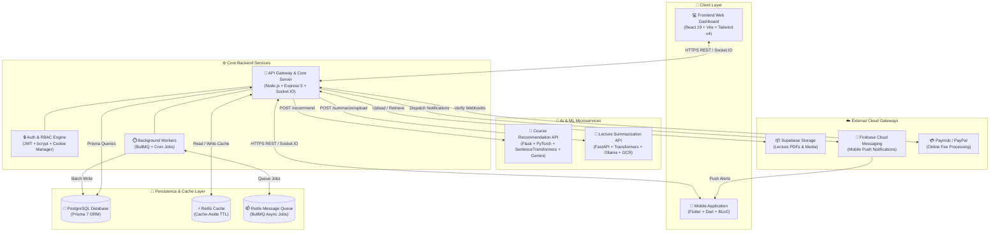

<div align="center">
  

# 🎓 Academia - College Management Ecosystem

**An Enterprise-Grade, AI-Powered Unified University & College Management Platform**<br>
_Unifying Backend API Services, Interactive Web Dashboard, Cross-Platform Mobile Portal, and Advanced AI/ML Intelligence into a Single Comprehensive Campus Experience._

  <br>

[](LICENSE)
[](https://github.com/MuhammedMahmoud0/Academia-College-Management-Ecosystem/stargazers)
[](https://github.com/MuhammedMahmoud0/Academia-College-Management-Ecosystem/graphs/contributors)
[](https://github.com/MuhammedMahmoud0/Academia-College-Management-Ecosystem/commits/main)

  <br>

[](https://nodejs.org/)
[](https://expressjs.com/)
[](https://www.postgresql.org/)
[](https://www.prisma.io/)
[](https://reactjs.org/)
[](https://vitejs.dev/)
[](https://tailwindcss.com/)
[](https://flutter.dev/)
[](https://www.python.org/)
[](https://pytorch.org/)
[](https://fastapi.tiangolo.com/)
[](https://www.docker.com/)

</div>

---

## Table of Contents

- [Overview](#overview)
- [System Architecture](#system-architecture)
- [Technology Stack](#technology-stack)
- [Repository Structure](#repository-structure)
- [Frontend](#frontend)
- [Backend](#backend)
- [Mobile Application](#mobile-application)
- [AI & Machine Learning](#ai-machine-learning)
    - [Course Recommendation System](#course-recommendation-system)
    - [Lecture Summarization System](#lecture-summarization-system)
- [Deployment](#deployment)
- [Team](#team)
- [Demo Videos](#demo-videos)
- [License](#license)

---

<a id="overview"></a>


The **Academia College Management Ecosystem** is a unified, end-to-end digital campus solution designed to streamline academic operations, empower students and faculty, and enhance administrative decision-making. Built as a multi-client distributed platform, Academia bridges the gap between complex university workflows and intuitive, modern user interfaces.

### 🌐 Inter-Module Communication & Data Flow

The ecosystem operates seamlessly through structured protocols connecting four primary pillars:

1. **RESTful API & Real-Time Communication Layer**: The **Node.js/Express 5 Backend** serves as the central API gateway. Both the **React Web Application** and the **Flutter Mobile App** consume REST endpoints protected by JWT and role-based access controls (RBAC). For real-time updates—such as GPS-validated attendance check-ins, instant community chat/feed notifications, and exam alerts—client applications establish bidirectional persistent connections via **Socket.IO**.
2. **AI & Machine Learning Integration Layer**: The core backend communicates asynchronously with dedicated microservices running Python via **HTTP REST APIs**. When a student requests personalized course advice, the backend queries the **Flask Recommendation Service** (`POST /recommend`). When students or faculty upload academic PDFs or lecture notes, the backend forwards files to the **FastAPI Summarization Service** (`POST /summarize/upload`), which runs OCR and LLM summarization pipelines to generate concise study notes.
3. **Data Persistence & Cache-Aside Pipeline**: All structured academic records (students, courses, enrollments, schedules, grades, financial invoices) reside in a high-concurrency **PostgreSQL** database managed via **Prisma 7 ORM**. To achieve sub-millisecond response times, the backend implements a dual **Redis** architecture: one instance powers application-level caching, while the second drives asynchronous task execution using **BullMQ** (e.g., bulk Excel student imports and background notifications).
4. **Cloud Infrastructure & Gateways**: File storage for course materials and student submissions is managed via **Supabase Storage**. Mobile push notifications are orchestrated through **Firebase Cloud Messaging (FCM)**, while student online fee payments are securely processed via integrated **Paymob** and **PayPal** checkout gateways.

---

<a id="system-architecture"></a>


The following diagram illustrates the complete architectural topology of the Academia ecosystem, detailing data pathways between clients, API gateways, databases, background job queues, and specialized AI microservices:



---

<a id="technology-stack"></a>


### 🚀 Backend

| Technology            | Version / Tool                           | Role & Usage                                                                |
| --------------------- | ---------------------------------------- | --------------------------------------------------------------------------- |
| **Node.js**           | ES Modules (v20+)                        | High-performance asynchronous server runtime                                |
| **Express.js**        | v5.2.x                                   | Next-generation web application framework and REST router                   |
| **Socket.IO**         | v4.8.x                                   | Real-time bidirectional WebSocket server for live updates & attendance      |
| **Prisma ORM**        | v7.1.x (`@prisma/adapter-pg`)            | Type-safe database query engine and schema migration tool                   |
| **JWT & Bcrypt**      | `jsonwebtoken` v9 / `bcrypt` v6          | Secure stateless authentication, HTTP-only cookies, and password hashing    |
| **BullMQ & Redis**    | `bullmq` v5 / `ioredis` v5               | Enterprise asynchronous background job processing & caching                 |
| **Multer & Supabase** | `multer` v2 / `@supabase/supabase-js` v2 | Multipart file upload handling and secure object storage integration        |
| **ExcelJS**           | v4.4.x                                   | Automated spreadsheet processing for student roster imports & grade exports |

### 💻 Frontend

| Technology              | Version / Tool                          | Role & Usage                                                               |
| ----------------------- | --------------------------------------- | -------------------------------------------------------------------------- |
| **React**               | v19.1.x                                 | Core UI library for dynamic declarative web components                     |
| **Vite**                | v7.1.x                                  | Next-generation ultra-fast bundler and development server                  |
| **Tailwind CSS**        | v4.1.x (`@tailwindcss/vite`)            | Utility-first styling engine with glassmorphism and responsive design      |
| **Material UI (MUI)**   | v7.3.x (`@mui/material`, `x-data-grid`) | Enterprise data tables, interactive cards, and accessible icons            |
| **GSAP & Lenis**        | v3.15.x / `lenis` v1.3.x                | Fluid micro-animations, layout transitions, and smooth scrolling           |
| **Chart.js & Recharts** | v4.5.x / v3.3.x                         | Visualizing student academic analytics, GPA trends, and grade distribution |
| **Socket.IO Client**    | v4.8.x                                  | Real-time listener for community feed posts and instant announcements      |

### 📱 Mobile

| Technology                   | Version / Tool                   | Role & Usage                                                            |
| ---------------------------- | -------------------------------- | ----------------------------------------------------------------------- |
| **Flutter & Dart**           | SDK v3.8+                        | Cross-platform native compilation for iOS and Android                   |
| **Flutter BLoC**             | `flutter_bloc` v9.1.x            | Predictable, event-driven state management architecture                 |
| **Go Router**                | `go_router` v16.3.x              | Deep linking and declarative navigation routing                         |
| **Dio & Cookie Manager**     | `dio` v5.9.x / `cookie_jar` v4.x | Interceptor-based networking with automated transparent token refresh   |
| **Local Auth**               | `local_auth` v2.3.x              | Biometric authentication (Face ID / Fingerprint / Passcode) app lock    |
| **Mobile Scanner**           | `mobile_scanner` v7.2.x          | Hardware-accelerated QR code scanner for classroom attendance check-ins |
| **Firebase Cloud Messaging** | `firebase_messaging` v16.x       | System push notifications even when the app is in background/terminated |

### 🧠 AI & Machine Learning

| Technology                   | Version / Tool                           | Role & Usage                                                             |
| ---------------------------- | ---------------------------------------- | ------------------------------------------------------------------------ |
| **PyTorch**                  | Deep Learning Framework                  | Tensor operations and neural network model execution                     |
| **Sentence-Transformers**    | Bi-Encoder & Cross-Encoder               | Computing semantic similarity between student profiles and course skills |
| **Google Gemini API**        | `google-generativeai` (Gemini 2.5 Flash) | Generative LLM reasoning for personalized course selection rationales    |
| **Transformers & Ollama**    | Hugging Face / Ollama LLM Engine         | Advanced natural language summarization of complex academic literature   |
| **PyTesseract & pdfplumber** | OCR & PDF Extraction                     | Optical Character Recognition for scanned lecture handouts and PDFs      |
| **FastAPI & Flask**          | REST microframeworks                     | Lightweight production endpoints exposing machine learning models        |

### 🗄️ Database & Cloud

| Technology           | Version / Tool          | Role & Usage                                                     |
| -------------------- | ----------------------- | ---------------------------------------------------------------- |
| **PostgreSQL**       | Relational SQL Database | Primary ACID-compliant relational data store                     |
| **Redis**            | In-Memory Data Store    | High-speed cache layer (TTL) and background task queue broker    |
| **Supabase Storage** | Cloud Object Store      | Hosting syllabus files, lecture slides, assignments, and avatars |

### 🛠️ DevOps & Tooling

| Technology            | Version / Tool            | Role & Usage                                                      |
| --------------------- | ------------------------- | ----------------------------------------------------------------- |
| **Docker**            | Containerization          | Multi-stage container environments for backend and AI services    |
| **Swagger / OpenAPI** | `swagger-ui-express` v5.x | Automated interactive API contract verification and documentation |
| **ESLint & Winston**  | Code Quality & Logging    | Strict linting rules and structured production logging output     |

---

<a id="repository-structure"></a>


The ecosystem is organized into modular subrepositories and directories within this central documentation hub:

```text
Academia-College-Management-Ecosystem/
├── Source/
│   └── assets/                     # Official project logos, diagrams, and branding assets
├── backend/                        # Node.js + Express 5 Core API Gateway & Real-time Server
│   ├── src/
│   │   ├── config/                 # Prisma DB connection, Swagger specs, Redis setup
│   │   ├── controllers/            # Business logic handlers (Auth, Courses, Attendance, Payments, etc.)
│   │   ├── middlewares/            # JWT authentication, RBAC authorization, Multer file uploads
│   │   ├── routes/                 # Express REST endpoint routers
│   │   └── utils/                  # Socket.IO emitter, BullMQ queues, Cron jobs, Supabase client
│   ├── prisma/                     # Database schema.prisma, migration scripts, and seeders
│   ├── tests/                      # Smoke tests and automated integration test suites
│   └── package.json
├── frontend/                       # React 19 + Vite Web Application Dashboard
│   └── college-system/
│       ├── src/
│       │   ├── components/         # Modular UI widgets (Analytics, Community, Registration, Schedule)
│       │   ├── pages/              # Main layout shells (Student, Doctor, Admin Dashboards)
│       │   └── services/           # Axios HTTP client interceptors and Socket listeners
│       ├── netlify.toml            # Deployment configuration
│       └── package.json
├── mobile/                         # Flutter Cross-Platform Mobile Application
│   ├── lib/
│   │   ├── core/                   # Shared API client, theme cubits, routing, local storage
│   │   ├── features/               # Feature modules (Auth, Home, Courses, Exams, ID, Attendance)
│   │   └── layout/                 # Bottom navigation shell and responsive wrappers
│   └── pubspec.yaml
└── ai/                             # Python AI/ML Microservices
    ├── recommendation/             # Course Recommendation Engine
    │   ├── app.py                  # Flask REST API endpoint (/recommend)
    │   ├── Course_Recommendation_cross_score_gem.ipynb # Model exploration notebook
    │   ├── Coursera.csv            # Course training and embedding dataset
    │   └── requirements.txt
    └── summarization/              # Document Summarization Engine
        ├── api.py                  # FastAPI REST API server
        ├── main.py                 # Core OCR extraction and NLP summarization pipeline
        ├── SummerizationModelipynb_v3.ipynb # Model training & evaluation notebook
        ├── postman/                # API collection and verification tests
        └── requirements.txt
```

---

<a id="frontend"></a>


### 🌟 Overview

The Academia Frontend is a sleek, dynamic web dashboard crafted with **React 19**, **Vite**, and **Tailwind CSS v4**. Designed to provide dedicated interfaces for Students, Professors, Teaching Assistants, and University Administrators, it delivers rich data visualization, smooth animations via GSAP, and intuitive academic workflows.

### ✨ Features

- **Role-Tailored Dashboards**: Customized workspace layouts for students (grades, schedule, fee payments), instructors (course management, grade submissions, materials), and administrators (user management, system configuration, academic calendar).
- **Interactive Academic Analytics**: Visual charts powered by Chart.js and Recharts displaying semester GPA trends, credit distribution, and class attendance statistics.
- **Dynamic Course Registration**: Real-time course offering selection with prerequisite verification, capacity tracking, and conflict-free group scheduling.
- **Social Community Hub**: Campus social feed allowing students and instructors to post discussions, share study resources, comment, and form study groups.
- **Digital Financial Desk**: Online fee breakdown, invoice management, and secure integrated online payment processing.

### 🛠️ Technologies

- **Core Framework**: React 19, Vite 7
- **Styling & UI**: Tailwind CSS v4, Material UI (MUI v7), Lucide Icons
- **Animation**: GSAP (@gsap/react), Lenis Smooth Scroll
- **State & Routing**: React Router v7, Axios, Socket.IO Client

### 🎥 Demo Video

> _Placeholder for Web Dashboard Video Walkthrough:_  
> `<a href="#demo-videos">Watch Web Demo Walkthrough below</a>`

### ⚙️ Setup & Local Development

```bash
# 1. Navigate to the frontend directory
cd frontend/college-system

# 2. Install dependencies
npm install

# 3. Create environment configuration (.env)
echo "VITE_API_BASE_URL=http://localhost:3000/api" > .env

# 4. Launch the development server
npm run dev
```

### 🔗 Repository Link

- **Standalone Frontend Repository**: [https://github.com/VALKAN00/college-system-frontend](https://github.com/VALKAN00/college-system-frontend)

---

<a id="backend"></a>


### 🌟 Overview

The core backend server powers the entire ecosystem, handling complex university rules, asynchronous background tasks, and real-time sockets. Built with **Node.js (ES Modules)**, **Express 5**, and **Prisma 7**, it guarantees enterprise reliability, data integrity, and strict access control.

### ✨ Features

- **Complete Academic Domain Operations**: Full CRUD and business logic for departments, courses, prerequisites, semester offerings, registrations, lecture schedules, and examination timetables.
- **Real-Time GPS Attendance**: WebSocket-powered check-in verification checking student GPS coordinates against lecture hall boundaries, with instant instructor override capabilities.
- **Advanced Grade Management**: Midterm, coursework, and final examination scoring with automated grade distribution calculations and direct Excel spreadsheet transcript exports.
- **Dual Payment Integration**: Multi-gateway payment handling supporting both PayPal Checkout SDK and Paymob payment webhooks.
- **Automated Background Processing**: BullMQ job processing on Redis for asynchronous high-volume Excel student imports and scheduled exam reminder notifications.

### 🛠️ Technologies

- **Runtime & Router**: Node.js v20+, Express 5
- **ORM & Database**: Prisma 7, PostgreSQL
- **Real-Time & Caching**: Socket.IO v4, Redis (BullMQ + Cache-Aside)
- **Security & Storage**: JWT, bcrypt, Helmet, Rate Limiter, Supabase Cloud Storage

### 🏛️ Architecture & Database

The backend enforces a strict layering pattern: `Route → Middleware (Auth/Upload) → Controller → Prisma ORM / Service → Database`. The PostgreSQL schema contains fully structured relational entities with cascading deletes, foreign key safeguards, and optimized indexes on high-traffic fields (such as student enrollments and attendance records).

### 📖 API Documentation

Once the backend is running, interactive OpenAPI / Swagger documentation is automatically hosted and accessible at:

```text
http://localhost:3000/docs
```

### ⚙️ Setup & Local Development

```bash
# 1. Navigate to the backend directory
cd backend

# 2. Install dependencies
npm install

# 3. Copy the example environment file and configure variables
cp .env.example .env

# 4. Run database migrations and generate Prisma Client
npx prisma migrate dev
npx prisma generate

# 5. Start the development server with file watch
npm run dev
```

### 🔗 Repository Link

- **Standalone Backend Repository**: [https://github.com/MuhammedMahmoud0/college-system-backend](https://github.com/MuhammedMahmoud0/college-system-backend)

---

<a id="mobile-application"></a>


### 🌟 Overview

The **Academia Mobile Application** puts the entire university experience into students' pockets. Built with **Flutter**, it delivers native iOS and Android performance, biometric security, and offline resilience with full English and Arabic (RTL) localization.

### ✨ Features

- **Biometric App Lock**: Gated launch requiring device fingerprint, Face ID, or passcode via `local_auth` on returning sessions.
- **Instant QR Attendance Scanner**: Built-in camera scanner (`mobile_scanner`) allowing students to scan classroom QR codes for instant attendance check-ins.
- **Digital Student ID Card**: Interactive front-and-back digital identity card displaying student credentials, academic standing, and library access barcode.
- **In-App Study Material Reader**: Download and view lecture PDFs directly within the app using `flutter_cached_pdfview`.
- **Transparent Token Refresh Networking**: Interceptor-powered Dio client that captures `401 Unauthorized` responses, silently refreshes JWT access tokens via disk-cached cookies (`PersistCookieJar`), and replays failed requests without user disruption.

### 🛠️ Technologies

- **Core Engine**: Flutter SDK v3.8+, Dart v3.8+
- **State Management & Routing**: Flutter BLoC v9.1, Go Router v16.3
- **Networking & Storage**: Dio v5.9, Cookie Jar, Hive, Flutter Secure Storage
- **Native Hardware**: Mobile Scanner, Geolocator, Local Auth, Firebase Cloud Messaging

### 🎥 Demo Video

> _Placeholder for Mobile Application Walkthrough:_  
> `<a href="#demo-videos">Watch Mobile App Walkthrough below</a>`

### ⚙️ Setup & Local Development

```bash
# 1. Navigate to the mobile directory
cd mobile

# 2. Fetch Flutter packages
flutter pub get

# 3. Generate Hive adapters and localization files (if needed)
dart run build_runner build --delete-conflicting-outputs

# 4. Run on connected emulator or physical device
flutter run
```

### 🔗 Repository Link

- **Standalone Mobile Repository**: [https://github.com/KaboOA/graduation_project](https://github.com/KaboOA/graduation_project)

---

<a id="ai-machine-learning"></a>


The ecosystem incorporates two specialized artificial intelligence services that elevate the academic learning experience.

---

### 🎯 Course Recommendation System

#### 📖 Overview

An AI recommendation service that analyzes a student's academic background, skill proficiencies, and personal career interests to suggest highly relevant courses from curriculum and online offerings.

#### ❓ Problem Solved

Students often struggle to navigate elective options and identify courses that align with current tech market demands and their past academic trajectory. This engine automates intelligent curriculum guidance.

#### 📊 Dataset

Utilizes a structured course embeddings dataset (`Coursera.csv`) containing over 3,500 curated courses with skills tags, difficulty ratings, and descriptive summaries.

#### 🛠️ Technologies

- **Language & Server**: Python 3, Flask REST API (`gunicorn`)
- **Deep Learning**: PyTorch, Sentence-Transformers (`CrossEncoder`, `Bi-Encoder`)
- **LLM Reasoning**: Google Generative AI (`gemini-2.5-flash`)

#### 🏗️ Model Architecture & Workflow

1. **Preprocessing**: Course titles, descriptions, and skill tags are cleaned and tokenized into semantic vectors using trained Bi-Encoder neural networks.
2. **Cross-Score Ranking**: When a student inputs target interests or past coursework, the model computes cross-score semantic similarity against the vector space.
3. **Generative Rationale**: Top-ranking candidates are passed to Gemini 2.5 Flash to synthesize tailored explanations explaining _why_ the course fits the student's learning goals.

#### 📡 API Endpoint

```http
POST /recommend
Content-Type: application/json

{
  "interests": ["machine learning", "data science", "neural networks"]
}
```

#### ⚙️ Setup & Local Development

```bash
cd ai/recommendation
python -m venv venv && source venv/bin/activate
pip install -r requirements.txt
export GEMINI_API_KEY="your_api_key_here"
python app.py
# Server listens on http://localhost:5000
```

#### 🔗 Repository Link

- **Recommendation Module**: [Source Code Directory](file:///home/muhammed_mahmoud/Projects/My_GitHub/Academia-College-Management-Ecosystem/ai/recommendation)

---

### 📑 Lecture Summarization System

#### 📖 Overview

An advanced NLP document summarization service that digests multi-page academic textbooks, scanned lecture handouts, and slide decks into structured, easy-to-review study sheets.

#### ❓ Problem Solved

Long academic documents consume hours of manual revision time. This tool instantly extracts key conceptual summaries categorized by page number and content type.

#### 🛠️ Technologies

- **Language & Server**: Python 3, FastAPI (`uvicorn`)
- **Document Processing**: `pdfplumber`, `pdf2image`, PyTesseract OCR, Pillow
- **Summarization Engine**: Hugging Face Transformers, PyTorch, Ollama LLM integration

#### 🏗️ Model Architecture & Workflow

1. **Document Ingestion**: Accepts direct PDF file uploads (`multipart/form-data`) or server file paths.
2. **Hybrid Extraction**: Evaluates document pages; clean text is parsed via `pdfplumber`, while image-heavy or scanned pages pass through a Tesseract OCR preprocessing pipeline.
3. **Chunked Summarization**: Extracts conceptual cores and outputs structured JSON metadata containing page-by-page breakdowns (`Visual` vs `Text` notes) and executive summaries.

#### 📡 API Endpoints

```http
POST /summarize/upload
Content-Type: multipart/form-data

file: <PDF File>
```

_Additional exposed routes:_ `POST /summarize/path`, `POST /summarize/upload/structured`, `POST /summarize/path/structured`.

#### ⚙️ Setup & Local Development

```bash
cd ai/summarization
python -m venv venv && source venv/bin/activate
pip install -r requirements.txt
# Ensure Tesseract OCR is installed on system OS
python api.py
# Server listens on http://localhost:5001
```

#### 🔗 Repository Link

- **Summarization Module**: [Source Code Directory](file:///home/muhammed_mahmoud/Projects/My_GitHub/Academia-College-Management-Ecosystem/ai/summarization)

---

<a id="deployment"></a>


Deploying the complete Academia ecosystem in production involves deploying each decoupled layer to specialized cloud infrastructure:

| Component                  | Target Environment                                    | Deployment Strategy                                                                                                                                         |
| -------------------------- | ----------------------------------------------------- | ----------------------------------------------------------------------------------------------------------------------------------------------------------- |
| **Core Backend API**       | Docker Container / Cloud VPS (AWS EC2 / DigitalOcean) | Packaged via Node.js Docker container behind Nginx reverse proxy with SSL termination. Connected to managed PostgreSQL and Redis cloud clusters.            |
| **Frontend Web Dashboard** | Netlify / Vercel Edge Network                         | Automated CI/CD pipeline triggered on git push. Builds optimized static assets via `vite build` configured with environment API endpoints (`netlify.toml`). |
| **Mobile Application**     | Google Play Store & Apple App Store                   | Compiled to release APK/AAB and iOS IPA bundles via Flutter build tools. Managed via Firebase App Distribution during QA testing.                           |
| **AI Microservices**       | Dedicated GPU / High-RAM Cloud Instances              | Hosted as isolated Docker containers running Uvicorn/Gunicorn workers. Communicates over internal VPC network with the Core Backend API.                    |

---

<a id="team"></a>


The Academia Ecosystem was conceptualized, architected, and engineered by a dedicated graduation team. Contributors are dynamically retrieved from git commits across all module repositories:

### 🚀 Backend Team

<div align="center">
  <table width="90%">
    <tr>
      <td align="center" width="50%">
        <a href="https://github.com/MuhammedMahmoud0">
          <br />
          <sub><b>Muhammed Mahmoud</b></sub>
        </a><br />
        <small><code>@MuhammedMahmoud0</code></small><br />
        <small>✉️ muhammedmahmoud091@gmail.com</small><br />
        <i>Ecosystem Architect & Backend Lead</i>
      </td>
      <td align="center" width="50%">
        <a href="https://github.com/Abdallah1Atef">
          <br />
          <sub><b>Abdallah Atef</b></sub>
        </a><br />
        <small><code>@Abdallah1Atef</code></small><br />
        <small>✉️ atef123khmes@gmail.com</small><br />
        <i>Backend Developer</i>
      </td>
    </tr>
  </table>
</div>

### 💻 Frontend Team

<div align="center">
  <table width="90%">
    <tr>
      <td align="center" width="50%">
        <a href="https://github.com/VALKAN00">
          <br />
          <sub><b>Abdelrhman Ahmed</b></sub>
        </a><br />
        <small><code>@VALKAN00</code></small><br />
        <small>✉️ lito2182002@gmail.com</small><br />
        <i>Frontend Lead Developer</i>
      </td>
      <td align="center" width="50%">
        <a href="https://github.com/nahedrefaei">
          <br />
          <sub><b>Nahed Refaay</b></sub>
        </a><br />
        <small><code>@nahedrefaei</code></small><br />
        <i>Frontend Developer</i>
      </td>
    </tr>
  </table>
</div>

### 📱 Mobile Team

<div align="center">
  <table width="90%">
    <tr>
      <td align="center" width="50%">
        <a href="https://github.com/KaboOA">
          <br />
          <sub><b>Ahmed Kabary</b></sub>
        </a><br />
        <small><code>@KaboOA</code></small><br />
        <i>Mobile Lead Developer</i>
      </td>
      <td align="center" width="50%">
        <a href="https://github.com/mennaossama">
          <br />
          <sub><b>Menna Ossama</b></sub>
        </a><br />
        <small><code>@mennaossama</code></small><br />
        <small>✉️ mennaossama51@gmail.com</small><br />
        <i>Mobile Developer</i>
      </td>
    </tr>
  </table>
</div>

### 🧠 AI & Machine Learning Team

<div align="center">
  <table width="90%">
    <tr>
      <td align="center" width="50%">
        <a href="https://github.com/ZizoElkhateeb">
          <br />
          <sub><b>Ziad Mohamed</b></sub>
        </a><br />
        <small><code>@ZizoElkhateeb</code></small><br />
        <small>✉️ CDS.ZiadMohamed23135@alexu.edu.eg</small><br />
        <i>AI / ML Lead Engineer</i>
      </td>
      <td align="center" width="50%">
        <a href="https://github.com/MuhammedMahmoud0">
          <br />
          <sub><b>Muhammed Mahmoud</b></sub>
        </a><br />
        <small><code>@MuhammedMahmoud0</code></small><br />
        <small>✉️ muhammedmahmoud091@gmail.com</small><br />
        <i>ML Pipeline & API Integrations</i>
      </td>
    </tr>
  </table>
</div>

---

<a id="demo-videos"></a>


Below are placeholders reserved for GitHub-hosted demonstration walkthroughs showcasing the system in real-time operations:

### 💻 Web Demo Walkthrough

<div align="center">
  <details>
    <summary><b>▶️ Click to Expand Web Dashboard Demo Showcase</b></summary>
    <br/>
    <!-- Replace placeholder link below with actual video asset when uploaded -->
    <a href="https://github.com/MuhammedMahmoud0/Academia-College-Management-Ecosystem">
      
    </a>
    <br/>
    <i>Interactive Web Dashboard Walkthrough demonstrating course registration, analytics, and admin operations.</i>
  </details>
</div>

### 📱 Mobile Demo Walkthrough

<div align="center">
  <details>
    <summary><b>▶️ Click to Expand Mobile App Demo Showcase</b></summary>
    <br/>
    <!-- Replace placeholder link below with actual video asset when uploaded -->
    <a href="https://github.com/MuhammedMahmoud0/Academia-College-Management-Ecosystem">
      
    </a>
    <br/>
    <i>Cross-Platform Flutter Portal Walkthrough demonstrating biometric login, QR attendance scanner, and ID card.</i>
  </details>
</div>

---

<a id="license"></a>


This project is open-source software licensed under the **ISC License**.

```text
Copyright (c) 2026 Academia College Management Ecosystem Contributors

Permission to use, copy, modify, and/or distribute this software for any
purpose with or without fee is hereby granted, provided that the above
copyright notice and this permission notice appear in all copies.

THE SOFTWARE IS PROVIDED "AS IS" AND THE AUTHOR DISCLAIMS ALL WARRANTIES
WITH REGARD TO THIS SOFTWARE INCLUDING ALL IMPLIED WARRANTIES OF
MERCHANTABILITY AND FITNESS. IN NO EVENT SHALL THE AUTHOR BE LIABLE FOR
ANY SPECIAL, DIRECT, INDIRECT, OR CONSEQUENTIAL DAMAGES OR ANY DAMAGES
WHATSOEVER RESULTING FROM LOSS OF USE, DATA OR PROFITS, WHETHER IN AN
ACTION OF CONTRACT, NEGLIGENCE OR OTHER TORTIOUS ACTION, ARISING OUT OF
OR IN CONNECTION WITH THE USE OR PERFORMANCE OF THIS SOFTWARE.
```

---

<div align="center">
  <b>Built with ❤️ by the Academia Graduation Project Team</b><br/>
  <sub>Empowering Higher Education Through Modern Software Engineering & AI</sub>
</div>
